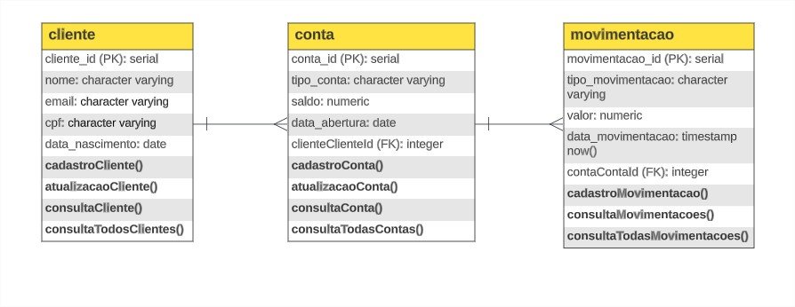
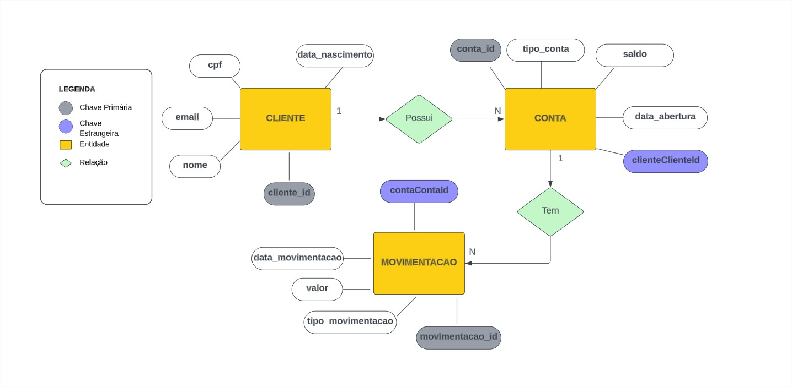
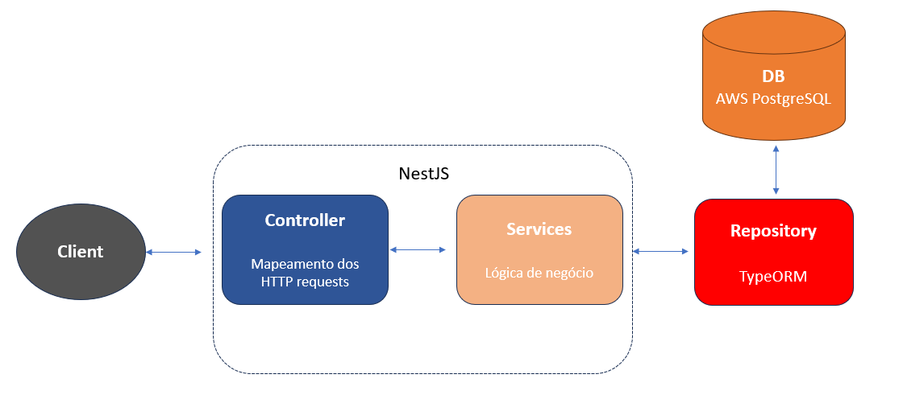
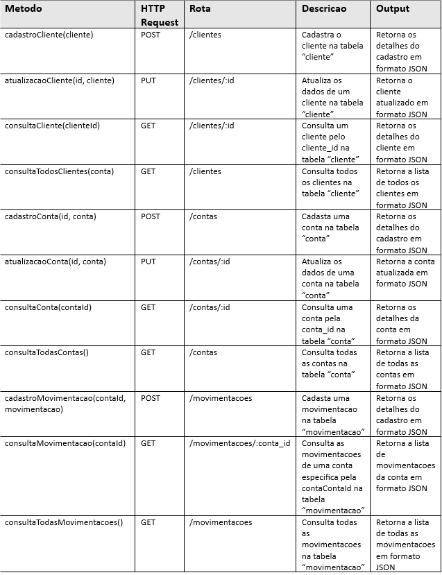

<h1 align="center">
API CONTA DIGITAL DEMO
</h1>

## Diagrama Entidade Relacionamento

<div style="display: flex; flex-direction: 'row'; align-items: 'center';">
   
</div>

## Modelo Entidade Relacionamento

<div style="display: flex; flex-direction: 'row'; align-items: 'center';">
   
</div>

## Scripts DDL e DML
Os scripts podem ser encontrados na pasta [scripts-SQL](https://github.com/pcaixeto/api-conta-digital-demo/tree/main/scripts-SQL).


## API

### Arquitetura da API

<div style="display: flex; flex-direction: 'row'; align-items: 'center';">
   
</div>

### Documentação da API

<div style="display: flex; flex-direction: 'row'; align-items: 'center';">
   
</div>

## Tecnologias e features usadas

<ul>
  <li>Typescript</li>
  <li>NestJS</li>
  <li>TypeORM</li>
  <li>Postman</li>
  <li>PostgreSQL</li>
</ul>


## Como rodar a API
```bash
# Clone o repositorio:
$ git clone 

# Instale as dependencias
$ npm install

# Execute no Browser
$ npm run start

```
OBS: o postgres usado é privado, configure seu próprio DB em ormconfig.json e src/app.module.ts

## TO-DOS
   - Interface do Cliente (front)
   - HTTP erros mais explicitos
   - Funcao de log para facilitar debug
   - testes unitarios usando o Jest


**By: Pedro Caixeta**
